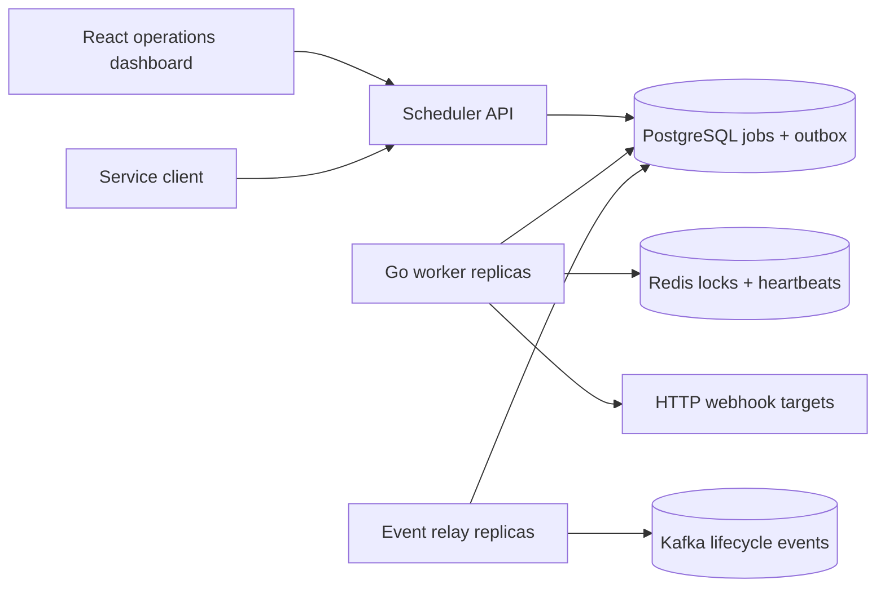
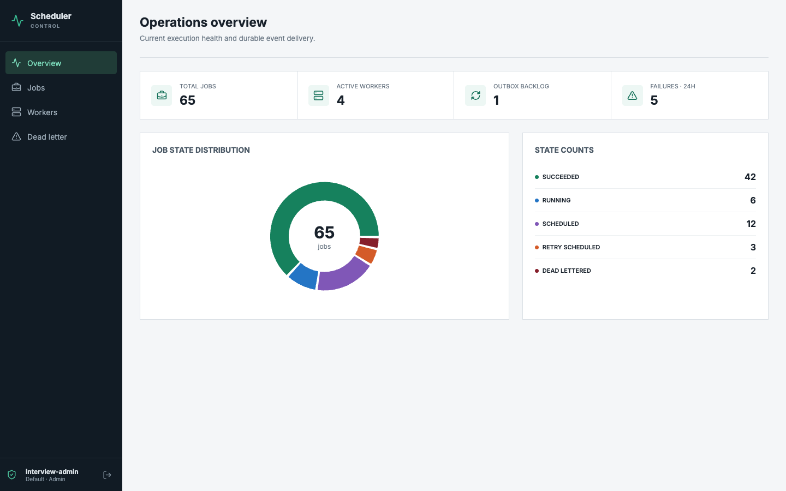

# Distributed Job Scheduler

A production-style, multi-tenant job scheduler built with Go, PostgreSQL, Redis, Kafka, React, Docker, and Kubernetes. It demonstrates how horizontally scaled workers coordinate without double-claiming jobs, recover from crashes, preserve lifecycle events during Kafka outages, and control external side effects with idempotency.

## Architecture



PostgreSQL is the source of truth. `FOR UPDATE SKIP LOCKED` provides primary job claiming, Redis adds owner-checked renewable leases, and the transactional outbox provides at-least-once Kafka delivery. External webhook consumers receive stable job and attempt headers and should deduplicate by idempotency key.

## Implemented Capabilities

- Immediate and scheduled webhook jobs with priorities, bounded exponential retries, timeouts, cancellation, pause/resume, and dead-letter requeue.
- Atomic job/attempt/DLQ/event transitions and expired-worker recovery.
- Tenant-scoped hashed API keys with viewer/operator/admin roles and Redis token-bucket rate limiting.
- Idempotent job creation through `Idempotency-Key`.
- Real HTTP execution with retry classification, `Retry-After`, redirect limits, response truncation, and SSRF controls.
- Durable event relay with leased outbox claims, retry backoff, replay, ordering by job key, and publication metrics.
- Prometheus HTTP, job, worker, execution, and outbox metrics.
- React operations dashboard for jobs, attempts, event timelines, workers, DLQ, and system summary.
- Docker Compose and Helm deployments with migration images, health probes, resource controls, autoscaling, PDBs, NetworkPolicy, and external Secret support.
- Unit, race, Testcontainers PostgreSQL/Redis/Redpanda, and frontend tests.

## Operations Dashboard



The same job, worker, DLQ, and event views adapt to mobile operations workflows; a verified mobile capture is available at [docs/images/dashboard-mobile.png](docs/images/dashboard-mobile.png).

## Run Locally

Prerequisites: Docker with Compose v2.

```bash
cp .env.example .env
make up
```

The stack applies migrations and creates the development key `djs_local_development_key_change_me` automatically.

- Dashboard: `http://localhost:3000`
- API: `http://localhost:8080`
- Kafka UI: `http://localhost:8081`
- Webhook echo target: `http://localhost:8082`

Create a job directly:

```bash
curl -X POST http://localhost:8080/api/v1/jobs \
  -H 'Content-Type: application/json' \
  -H 'X-API-Key: djs_local_development_key_change_me' \
  -H 'Idempotency-Key: interview-demo-001' \
  -d '{
    "name":"Deliver demo webhook",
    "job_type":"CALL_WEBHOOK",
    "payload":{"url":"http://webhook-sink:8080/success","method":"POST","body":{"demo":true}},
    "run_at":"2026-07-17T12:00:00Z",
    "priority":8,
    "max_retries":3,
    "retry_backoff_seconds":5,
    "timeout_seconds":20
  }'
```

For a new key outside Compose:

```bash
go run ./cmd/scheduler-admin create-api-key --name interview-admin --role admin
```

## Verification

```bash
make test
make race
make integration-test
make web-test
make verify
```

Integration tests require Docker. API details are in [docs/openapi.yaml](docs/openapi.yaml); architecture and failure flows are under [docs/system-design](docs/system-design/overview.md).

## Deployment

```bash
helm lint charts/distributed-job-scheduler
helm template scheduler charts/distributed-job-scheduler --set migrations.enabled=true
```

Production installations should set `existingSecret`, publish immutable image tags, configure TLS-enabled PostgreSQL/Redis/Kafka endpoints, and set an explicit webhook hostname allowlist.

## Guarantees and Limits

- Job execution and Kafka publication are **at least once**, not exactly once.
- PostgreSQL prevents concurrent claims; lease expiry permits recovery after a worker crash.
- Webhook idempotency headers control duplicate external effects.
- This project intentionally excludes workflow DAGs, recurring cron schedules, multi-region consensus, billing, and real payment/email integrations.

See [docs/code-guide.md](docs/code-guide.md) for the implementation reading order and [docs/interview-guide.md](docs/interview-guide.md) for the design narrative and tradeoffs.
