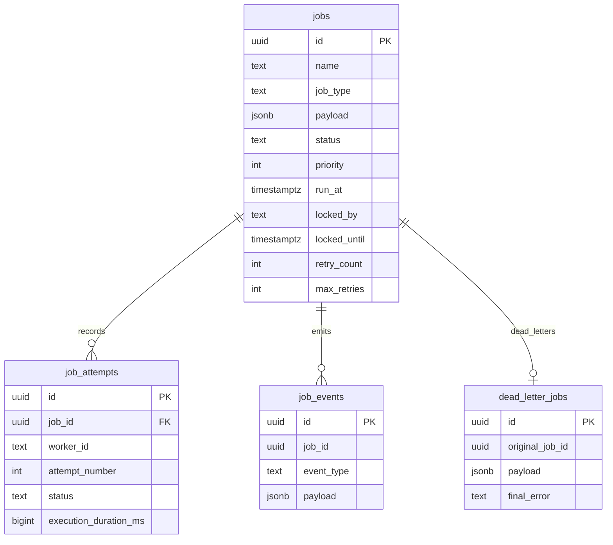

# Database Design

PostgreSQL is the source of truth. Redis and Kafka are coordination and eventing layers.

Transactional boundaries:

- claim due jobs and set lock owner in one SQL update
- attempt finalization and job status change must match the owning worker
- dead-letter insertion and job status update happen in one transaction
