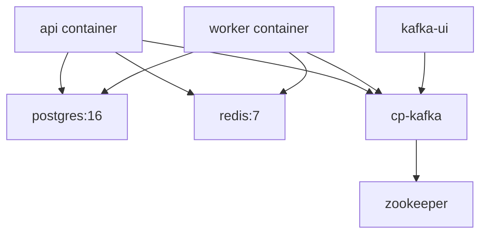
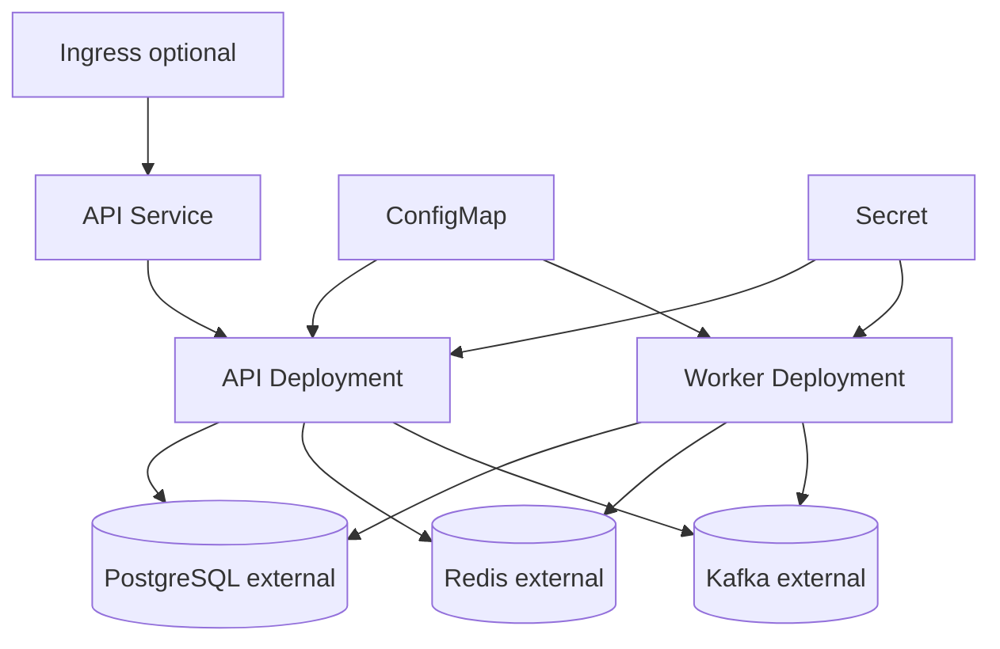

# Deployment Design

The project supports Docker Compose for local development and Helm for Kubernetes deployment.

## Docker Compose

## Kubernetes

The Helm chart keeps migrations disabled by default. Operators can enable the migration Job explicitly during controlled rollout.
