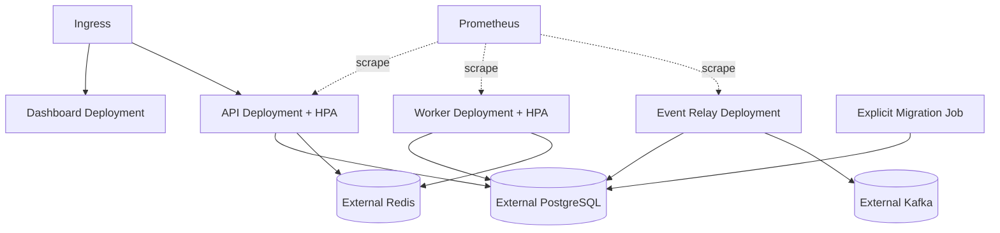
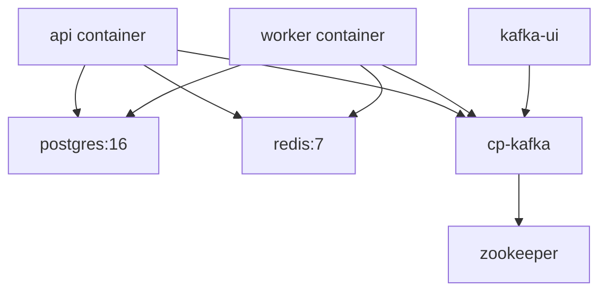
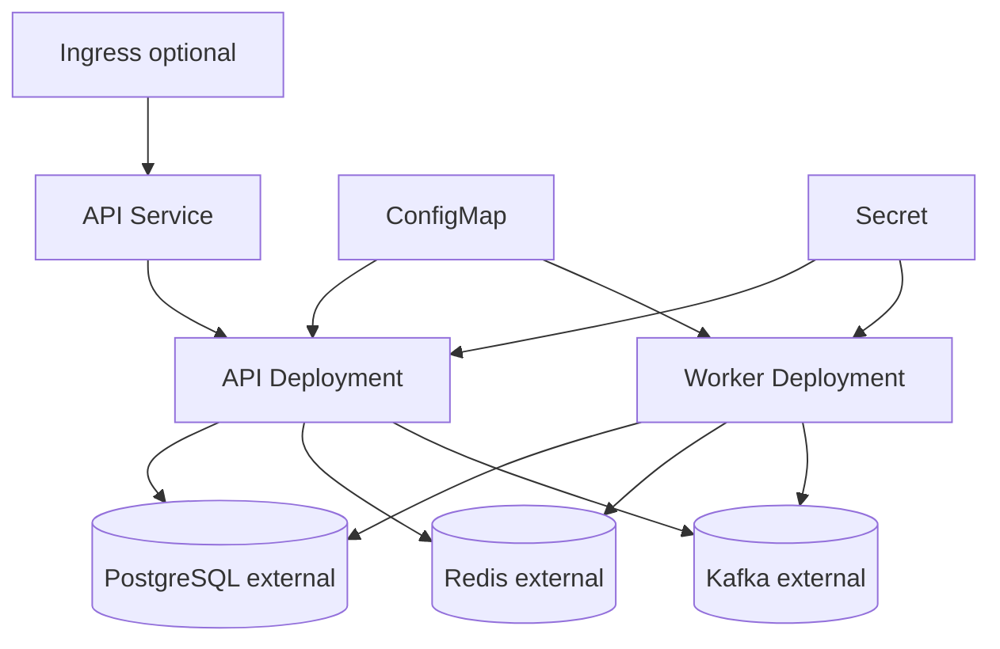

# Deployment Design

The chart supports an externally managed Secret, non-root containers, read-only root filesystems, health probes, resource requests/limits, disruption budgets, optional autoscaling, and a packaged migration image.

The project supports Docker Compose for local development and Helm for Kubernetes deployment.

## Docker Compose

## Kubernetes

The Helm chart keeps migrations disabled by default. Operators can enable the migration Job explicitly during controlled rollout.
