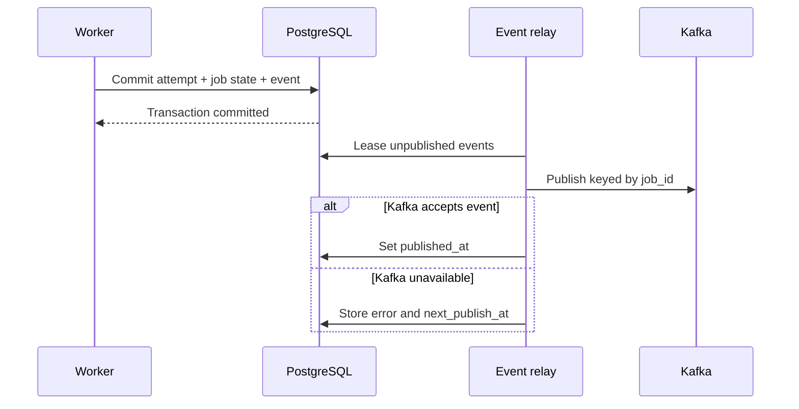

# Event Design

Lifecycle events are no longer published inline. Each state transaction inserts a versioned `job_events` row, and relay replicas lease unpublished rows with `FOR UPDATE SKIP LOCKED`.



Delivery is at least once. A relay crash between Kafka acknowledgement and `published_at` can publish the same `event_id` again, so consumers must deduplicate it.

Kafka publishing is best effort. PostgreSQL remains the source of truth when publishing fails.

Envelope:

```json
{
  "event_id": "uuid",
  "event_type": "job.completed",
  "source": "worker",
  "entity_type": "job",
  "entity_id": "job_id",
  "timestamp": "2026-07-02T12:00:00Z",
  "payload": {}
}
```

Events:

- `job.created`
- `job.started`
- `job.completed`
- `job.failed`
- `job.retry_scheduled`
- `job.dead_lettered`
- `job.cancelled`
- `worker.heartbeat`
