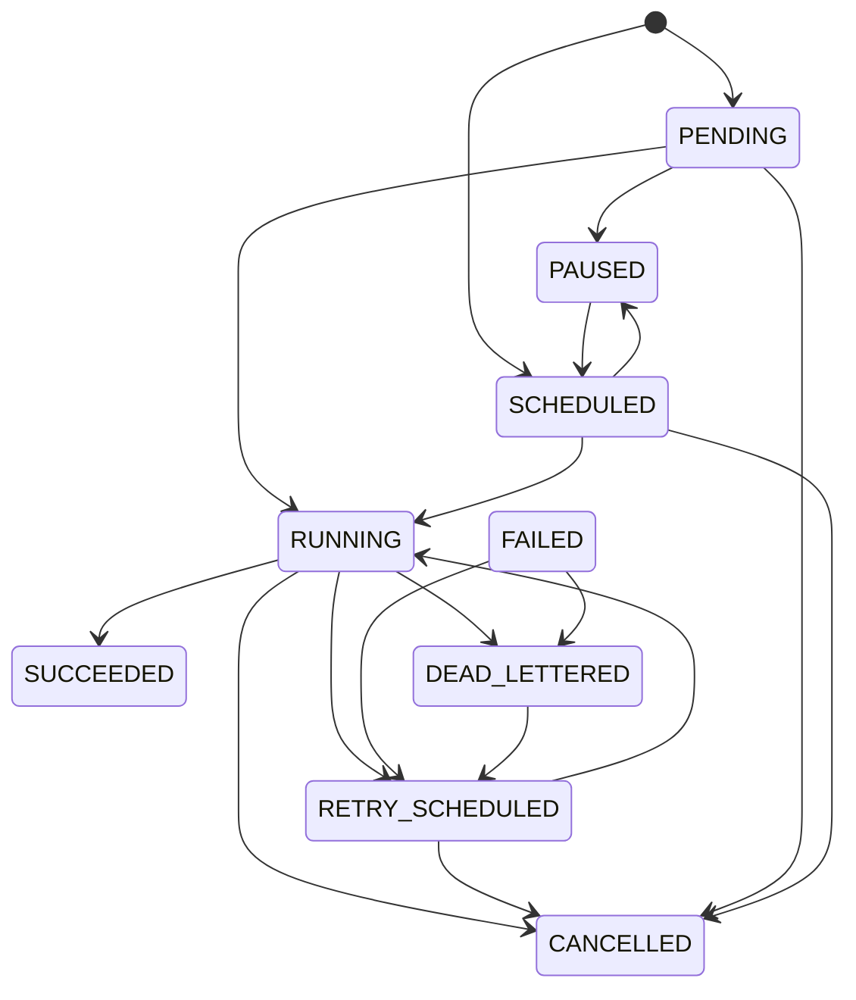
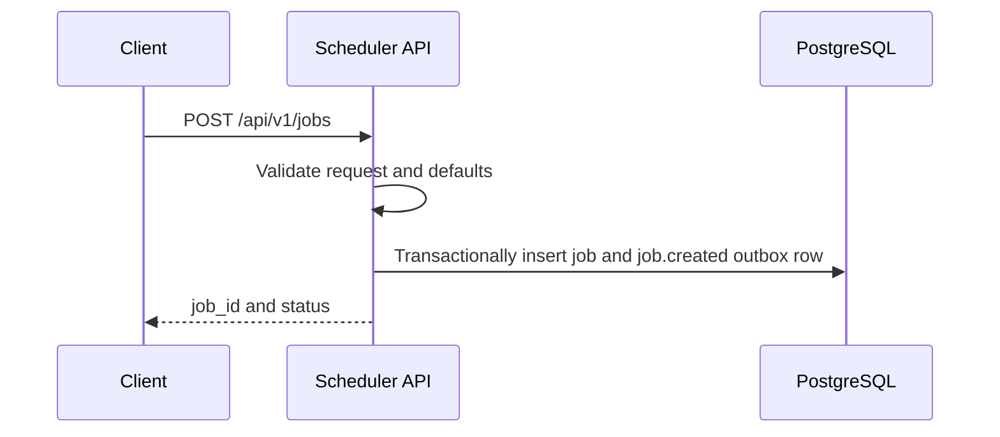
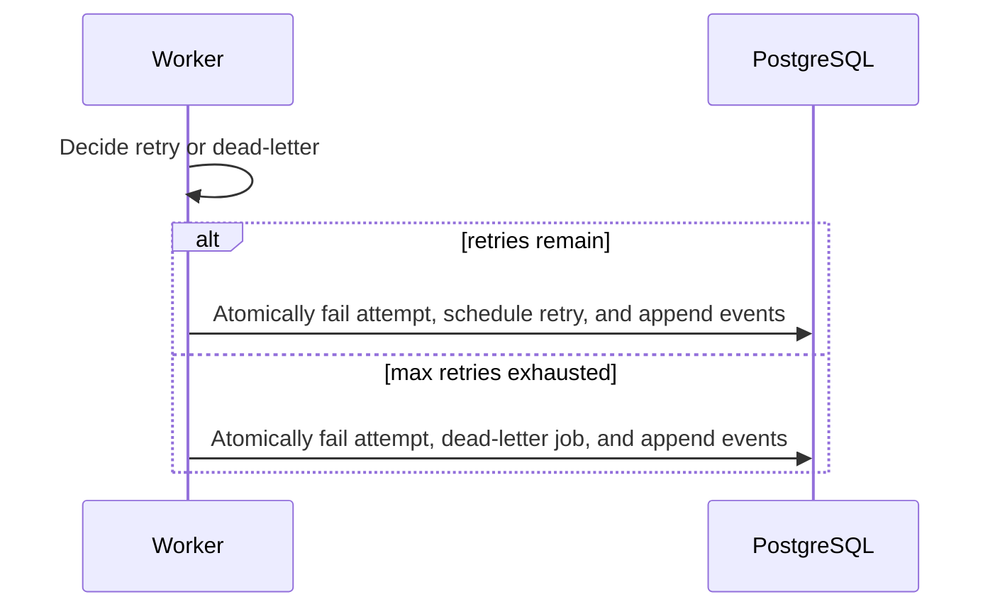

# Job Lifecycle

Jobs move through a constrained state machine. The scheduler domain validates transitions before services update storage.

```mermaid
stateDiagram-v2
    [*] --> PENDING
    [*] --> SCHEDULED
    PENDING --> RUNNING
    SCHEDULED --> RUNNING
    RUNNING --> SUCCEEDED
    RUNNING --> RETRY_SCHEDULED
    RUNNING --> DEAD_LETTERED
    RUNNING --> CANCELLED
    FAILED --> RETRY_SCHEDULED
    FAILED --> DEAD_LETTERED
    RETRY_SCHEDULED --> RUNNING
    RETRY_SCHEDULED --> CANCELLED
    PENDING --> CANCELLED
    SCHEDULED --> CANCELLED
    PENDING --> PAUSED
    SCHEDULED --> PAUSED
    PAUSED --> SCHEDULED
    DEAD_LETTERED --> RETRY_SCHEDULED
```

## Create Job

```mermaid
sequenceDiagram
    participant C as Client
    participant API as Scheduler API
    participant DB as PostgreSQL
    C->>API: POST /api/v1/jobs
    API->>API: Validate request and defaults
    API->>DB: Transactionally insert job and job.created outbox row
    API-->>C: job_id and status
```

## Retry and Dead Letter

```mermaid
sequenceDiagram
    participant W as Worker
    participant DB as PostgreSQL
    W->>W: Decide retry or dead-letter
    alt retries remain
        W->>DB: Atomically fail attempt, schedule retry, and append events
    else max retries exhausted
        W->>DB: Atomically fail attempt, dead-letter job, and append events
    end
```
