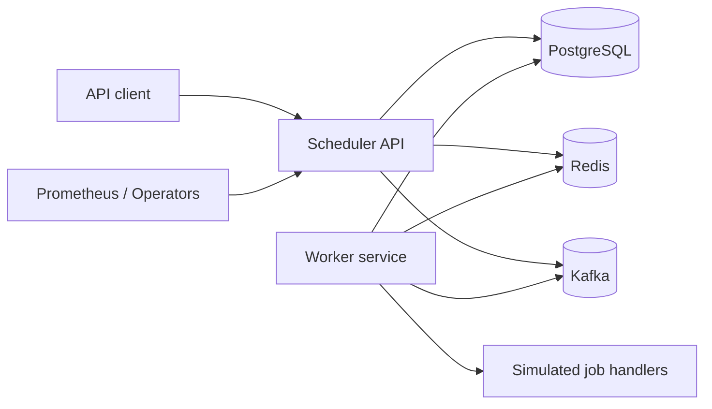

# System Overview

The Distributed Job Scheduler accepts scheduled work through an API, persists jobs in PostgreSQL, executes due jobs through horizontally scalable workers, coordinates execution with Redis locks, and publishes lifecycle events to Kafka.

## Goals

- Reliable job persistence and inspection.
- Safe multi-worker job claiming.
- Retry, timeout, and dead-letter handling.
- Operational controls for cancel, pause, resume, retry, and requeue.
- Kubernetes-ready deployment.

## Non-Goals

- Real email, payment, report, or webhook integrations.
- A frontend dashboard.
- Exactly-once execution guarantees across all external side effects.

## Container Diagram

