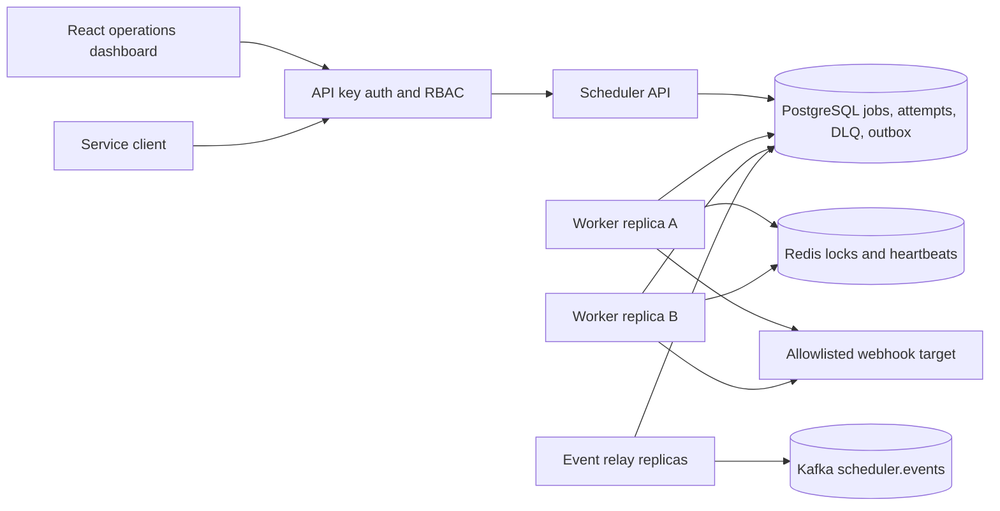
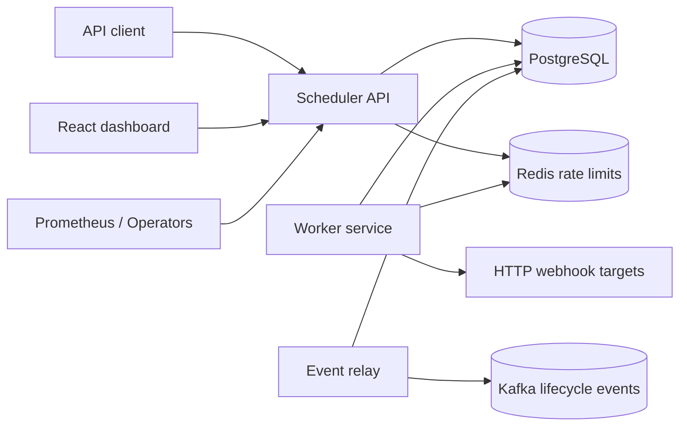

# System Overview

The API authenticates a tenant-scoped API key before any job query. Workers claim from all tenants but retain tenant identity on attempts, dead letters, and lifecycle events. Kafka is downstream of the durable event relay and is never part of the job-state transaction.

The Distributed Job Scheduler accepts scheduled work through an API, persists jobs in PostgreSQL, executes due jobs through horizontally scalable workers, coordinates execution with Redis locks, and publishes lifecycle events to Kafka.

## Goals

- Reliable job persistence and inspection.
- Safe multi-worker job claiming.
- Retry, timeout, and dead-letter handling.
- Operational controls for cancel, pause, resume, retry, and requeue.
- Kubernetes-ready deployment.

## Non-Goals

- Real email, payment, or report integrations beyond the implemented webhook executor.
- Exactly-once execution guarantees across all external side effects.
- Workflow DAGs, cron recurrence, billing, and multi-region consensus.

## Container Diagram

