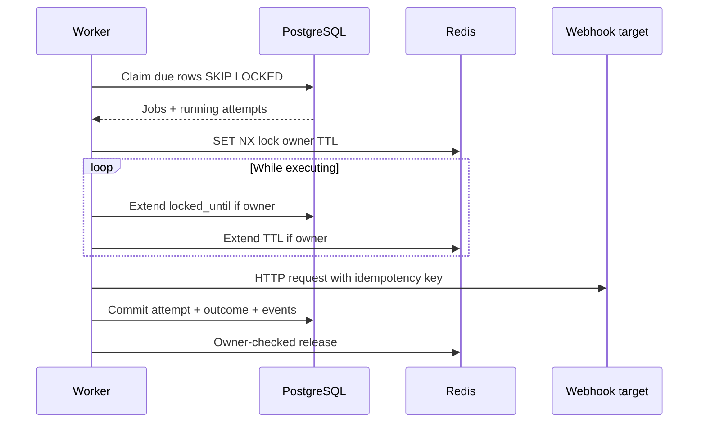
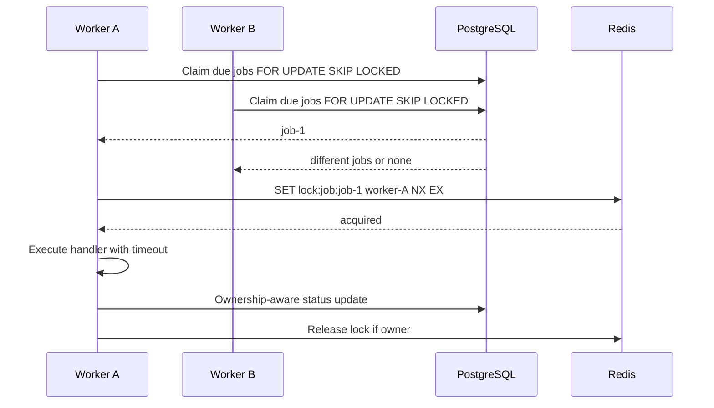
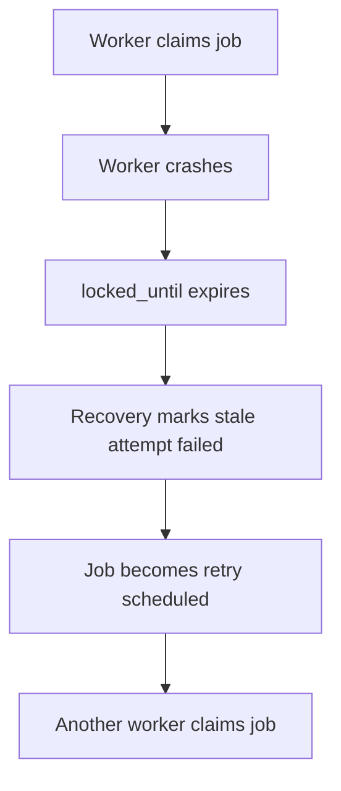

# Worker Coordination

Claims now create their `RUNNING` attempt and `job.started` event in the same transaction. During execution the worker renews both the PostgreSQL ownership deadline and owner-checked Redis TTL. Losing either lease cancels the handler context.

PostgreSQL is the primary duplicate-execution guard. Redis adds an execution lock after a job is claimed.

## Claim and Execute

## Crash Recovery

